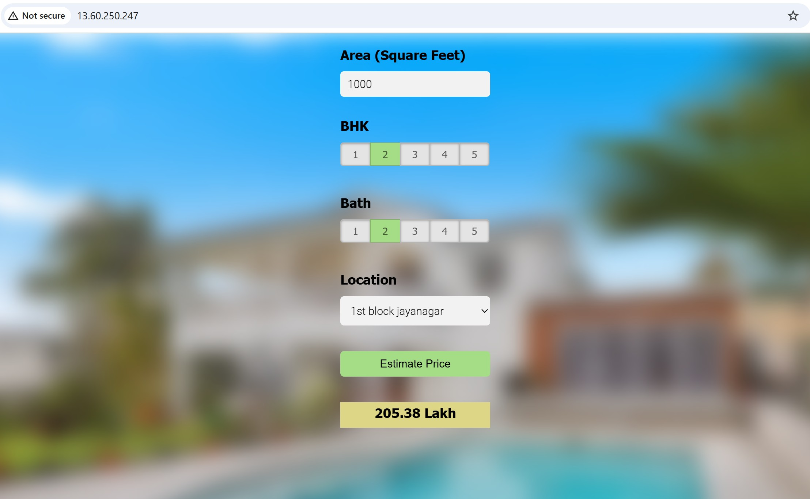

# Bangalore House Price Prediction

A Machine Learning web application that predicts house prices in Bangalore based on property features such as area, number of bedrooms (BHK), number of bathrooms, and location.

## Project Overview

This project uses a Linear Regression model trained on the Bangalore House Price dataset to estimate property prices. The model is integrated with a Flask backend and a responsive web interface built using HTML, CSS, and JavaScript.

The application was successfully deployed on AWS EC2 using Nginx as a reverse proxy.

## Features

* Predict Bangalore house prices instantly
* Select from multiple Bangalore locations
* User-friendly web interface
* Flask REST API backend
* Machine Learning model trained using Scikit-learn
* AWS EC2 deployment with Nginx

## Tech Stack

### Machine Learning

* Python
* NumPy
* Pandas
* Scikit-learn

### Backend

* Flask

### Frontend

* HTML
* CSS
* JavaScript
* jQuery

### Deployment

* AWS EC2
* Nginx
* Ubuntu Linux

## Project Structure

```
BHP/
│
├── client/
│   ├── app.html
│   ├── app.css
│   └── app.js
│
├── model/
│   └── BHP.ipynb
│
├── screenshots/
│   ├── Homepage.jpeg
│   └── sucessfull_predicted_result.jpeg
│
├── server/
│   ├── artifacts/
│   ├── server.py
│   └── util.py
│
├── .gitignore
│
└── README.md
```

## Machine Learning Workflow

1. Data Cleaning and Preprocessing
2. Feature Engineering
3. Outlier Removal
4. Model Training using Linear Regression
5. Model Evaluation
6. Model Serialization using Pickle
7. Flask API Integration
8. AWS Deployment

## API Endpoints

### Get Locations

```
GET /get_location_names
```

Returns the list of supported Bangalore locations.

### Predict Price

```
POST /predict_home_price
```

Parameters:

* total_sqft
* location
* bhk
* bath

Returns the estimated house price.

## Sample Prediction

Input:

* Area: 1000 sq.ft
* BHK: 2
* Bath: 2
* Location: 1st Block Jayanagar

Output:

```
Estimated Price: 205.38 Lakh
```

## Deployment

The application was deployed on:

* AWS EC2
* Ubuntu Server
* Nginx Reverse Proxy
* Flask Backend

## Screenshots

### Homepage


### Live Application Deployed on AWS EC2 with Successful Price Prediction


## Learning Outcomes

Through this project, I gained hands-on experience in:

* Data preprocessing
* Feature engineering
* Machine learning model development
* REST API creation using Flask
* Frontend and backend integration
* AWS cloud deployment
* Nginx server configuration

## Future Improvements

* Add authentication
* Improve UI/UX
* Support real-time market data
* Deploy on Vercel/Render for easier scalability

## Author

Sahil Khandare

Engineering Student | Machine Learning Enthusiast | Python Developer
